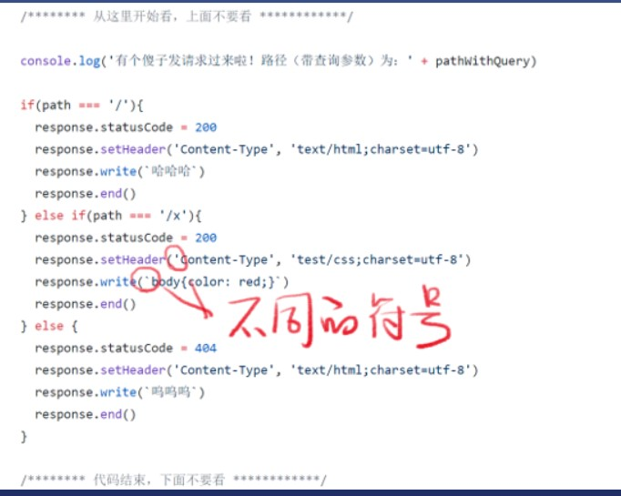

# http请求和响应
### 如何发请求
* 方法
1. 用chrome地址栏
2. 用curl命令
* 概念
1. 帮你请求的工具叫做用户代理
2. 英文名user agent

### 如何做出一个响应
* 需用编程
* node.js有一个http模块可以做到---初始代码链接[链接](https://raw.githubusercontent.com/FrankFang/nodejs-test/master/server.js)
* 注意事项
* 这些代码就是服务器代码,一般放在服务器上
* path是不带查询参数的路径/x
* query是查询参数的对象形式{a:'1'}
* queryString是查询参数的字符串形式?a=1
* pathWithQuery是带查询参数的路径,一般不用
* request是请求对象
* response是响应对象

* 注意符号
* 这是例

### 代码逻辑
* 语法
* `这种字符串 ``里面可以打回车
* '这种字符串'里面要回车只能用\n表示(ctrl+/住注释快捷键)
* 逻辑
* 每次收到请求都会把中间的代码执行一遍
* 用 if else判断路径,并返回响应
* 如果是已知路径,一律返回200
* 如果是未知路径,一律返回404
* content-Type表示内容的[类型/语法]
* response.write()可以填写返回内容
* response.end()表示响应可以发给用户了
* 注意
* url里的后缀卵用没有,/y.css不一定能够是css内容,content-type才是决定文件类型关键