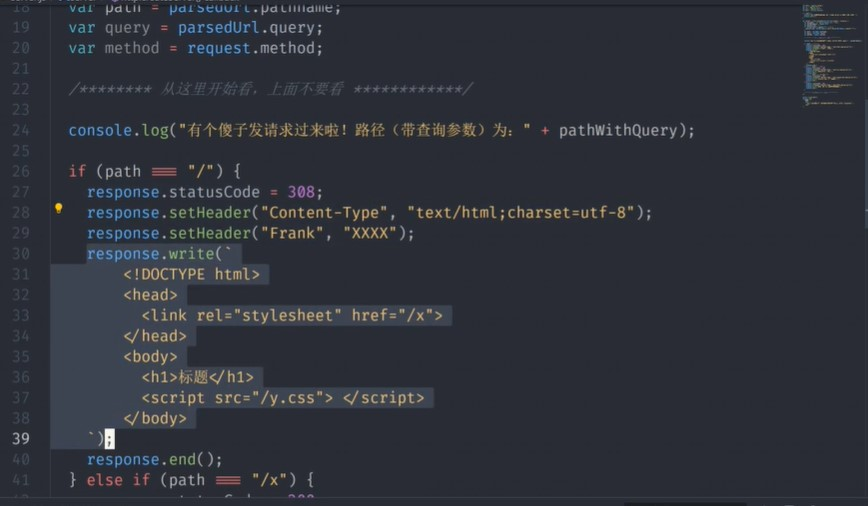
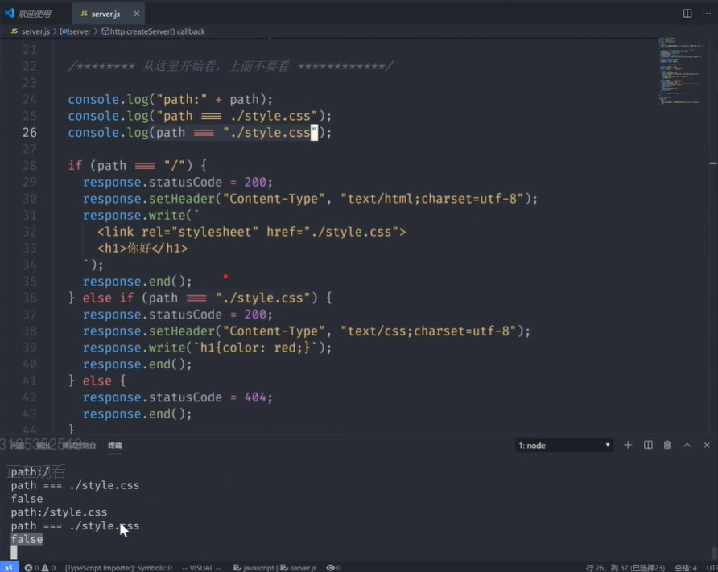

# 体系化学习http
* 必须学会
* 基础概念(有哪些必会)
* 如何调试(用的是node.js,可以用log/debugger)
* 在哪查资料(用的是node.js,看node.js文档)
* 标准制定者是谁(http规格文档:rfc 2612等)
* 如何学
* copy-抄文档,抄老师
* run-放在自己机器上运行成功
* modify加入自己的一点想法,然后重新运行
### http基础概念
* 请求-格式
* 请求动词 路径加查询参数   协议名/版本
* host: 域名或者ip
* accept: text/html
* content-type:请求格式
* 回车
* 请求体(也就是上传内容)
* 以下是注意细节
* 三部分:请求行,请求头.请求体
* 请求动词有 get--用来获取内容/post--上传内容/put/patch/delete
* 请求体在get请求中一般为空
* 文档位于rfc 2612第五章[网址](https://www.w3.org/Protocols/rfc2616/rfc2616-sec5.html)
* 大小写不敏感

2. 响应
* 协议名/版本 状态码(默认200) 状态字符串
* content-type:响应式的格式
* 回车
* 响应体(也是下载内容)
* 下面是注意细节
* 三部分:状态行,响应头,响应体
* 常见的状态码是考点
* 文档位于rfc 2612第六章[网址](https://www.w3.org/Protocols/rfc2616/rfc2616-sec6.html)

### 用curl请求
* curl -v http://127.0.0.1:8888
* 设置请求动词
* -x post
* 注意大小写
* 设置路径和查询参数
* 直接在url后面加
* 设置请求头
* -H 'Name:Value'或者--header 
'Name:value'
* 例子 -H 'Accept: text/html'
* 设置请求体
* -d '内容'或者--data'内容'

### 用node.js读取请求
1. 读取请求动词
*  request.method
2. 读取路径
* request.url路径,带查询参数
* path纯路径,不带查询参数
* query只有查询参数
3. 读取请求头
* request.headers['Accept']
4. 读取请求体

### 用node.js设置响应
1. 设置响应状态码
* response.statusCode =200(数字)

2. 设置响应头
* response.setHeader('Content-Type','text/html');

3. 设置响应体
* response.write('内容')
* 可追加内容

4. 这是例子

### console.log调试
* 所有的http路径都是以/开头的
* 
